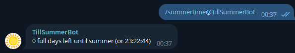

# TillSummerBotGo

## Overview

Return time untill Summer or Summer time passed.

## Supported commands
* `summertime` - get time untill Summer or Summer time passed.
* `subscribe` - subscribe chat and get `summertime` result every 12 MSK.
* `unsubscribe` - unsubscribe chat.
